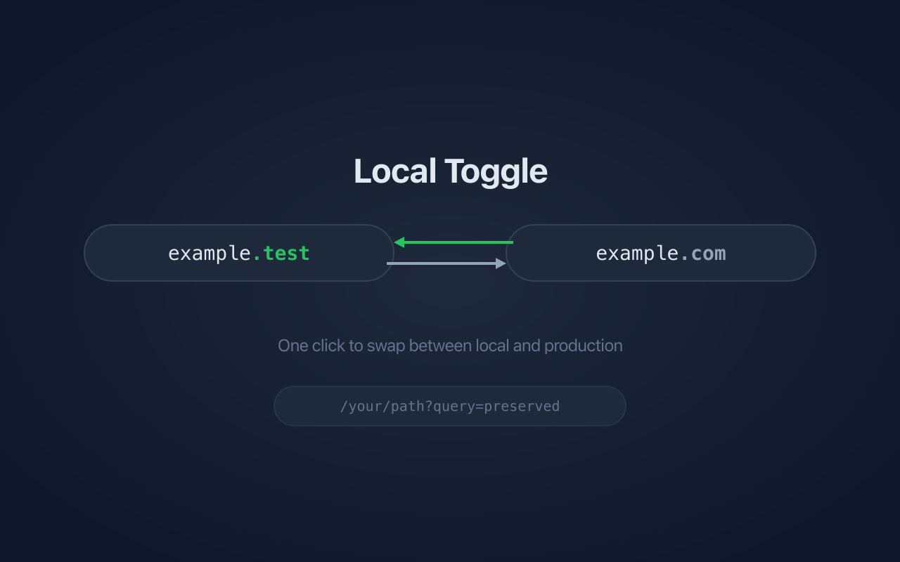

A Chrome extension for developers who work with local development servers. Instantly swap between your local test domain e.g. `.test` (default), `.local`, and production domain with a single click.

## Features

- **One-click toggle** — Click the extension icon to instantly switch between local and production
- **Preserves your path** — `/dashboard?tab=settings` stays intact when switching domains
- **Configurable TLDs** — Use any local TLD (`.test`, `.local`, `.dev`, etc.)
- **Hostname divergence** — Use completely different hostnames per environment (e.g., `app.example.com` and `dev.internal.test`)
- **Protocol control** — Toggle HTTPS independently for local and production
- **Side panel** — Configure domains from a persistent side panel with inline-editable URL fields
- **Multi-domain management** — View, edit, and navigate between all configured domains from the side panel
- **Remembers settings** — Configuration is saved per-domain and synced across devices
- **Badge indicator** — Shows "L" when you're on a local domain
- **Available in 9 languages** — English, German, Spanish, French, Italian, Japanese, Korean, Portuguese, and Chinese

## Installation

Go to the [Chrome Web Store](https://chromewebstore.google.com/detail/local-toggle/ffhipdkcckofgioiinopnacgpkndkllf) page and click "Add to Chrome"

## Usage

**First time setup from production domain:**
1. Visit any URL on production site (e.g., `example.com`)
2. Click the extension icon — you'll be taken to `example.test`

**First time setup from local domain:**
1. Visit any URL in your local development environment
2. Click the extension icon
3. Populate the production domain's TLD in the side panel that appears
4. Click Save

**Configuring settings:**
- Right-click the extension icon → "Configure Domains" to open the side panel
- Edit the protocol, hostname, or TLD inline for each environment
- To use different hostnames per environment, simply edit the hostname fields to differ

**Managing other domains:**
- Previously configured domains appear in the "Other domains" list
- Click the arrow icon to navigate to a domain, or the pencil icon to edit its settings

## How It Works

The extension extracts the base domain from your current URL and swaps the TLD while preserving the path, query parameters, and hash. When hostname divergence is configured, the full hostname is swapped as well. Settings are stored per-domain using Chrome's storage API and synced across devices.

## Permissions

- `activeTab` — Access the current tab's URL
- `storage` — Save your TLD preferences
- `tabs` — Navigate to the swapped URL
- `contextMenus` — Right-click menu options
- `sidePanel` — Configuration side panel

## Contributing

Put this in a pull request for review.

**Local Development**

See instructions for [Loading an unpacked extension](https://developer.chrome.com/docs/extensions/get-started/tutorial/hello-world#load-unpacked).

**Releasing a new version:**

Create a release in GitHub. Easiest way to do this is with the gh cli.

```bash
gh release create v2.1.0 --title "v2.1.0" --notes "Release notes here"
```

(assuming you have permission, which you probably don't) The GitHub Action will automatically update the manifest version, package the extension, and publish to the Chrome Web Store.

## License

MIT
